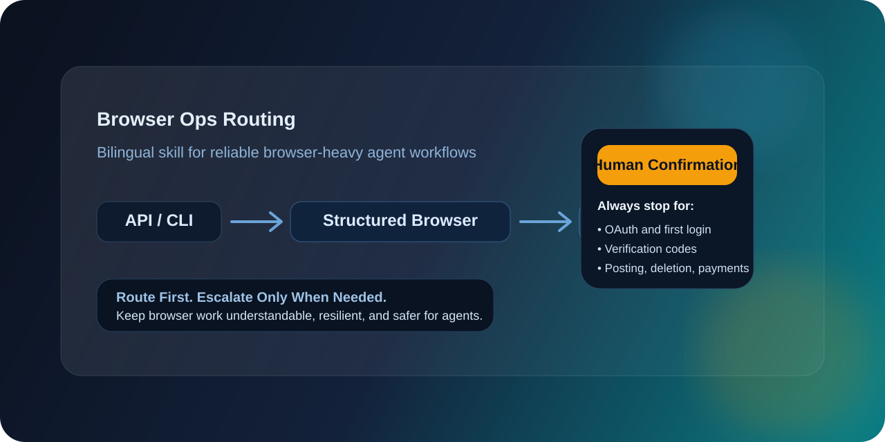

# Browser Ops Routing

**A bilingual routing skill for browser-heavy agent workflows.**  
Use the safest workable execution layer first:
`API/CLI -> Structured Browser Automation -> Visual Browser Control -> Human Confirmation`

[中文介绍](#中文介绍) · [English Overview](#english-overview) · [What's Included](#whats-included) · [Release Notes](#release-notes)

## Why This Exists

Agent browser work often fails for the same reason: teams jump straight into browser control before deciding whether the task should have been done through an API, a CLI, deterministic browser automation, or a human confirmation boundary.

This repository packages a reusable routing policy that helps agents:

- avoid unnecessary browser work
- prefer deterministic paths over fragile ones
- escalate to visual control only when it is justified
- stop before high-risk actions such as login approval, posting, deletion, payment, or security changes

## 中文介绍

`Browser Ops Routing` 是一个面向智能体网页任务的双语 skill。它不强调“让智能体接管浏览器”，而是强调**先做正确的分流**。

核心原则是：

- 能走 `API/CLI` 就不要先上浏览器
- 能走结构化浏览器自动化，就不要直接上视觉模式
- 视觉浏览器只作为兜底
- 登录授权、验证码、发布、删除、付款等高风险动作必须停下来人工确认

这套方法适合：

- Codex
- OpenClaw
- 其他带浏览器能力的 agent 系统

它的目标不是绑定某个产品，而是提供一套**稳定、可解释、可复用**的网页任务路由规则。

## English Overview

Browser Ops Routing is a lightweight policy skill for agent-driven browser work.

It gives agents a simple but practical execution order:

1. `API/CLI`
2. Structured browser automation
3. Visual browser control
4. Human confirmation

This keeps browser-heavy workflows more reliable, easier to reason about, and safer to operate across different agent stacks.

## What's Included

- `SKILL.md`
  Shared routing policy for browser work
- `agents/openai.yaml`
  UI metadata for skill pickers and skill libraries
- `references/openclaw.md`
  OpenClaw-specific implementation guidance kept outside the core shared policy

## Design Principles

- Keep human and AI browser state separated
- Use the least fragile layer that can complete the task
- Treat login, publishing, deletion, payments, and verification as confirmation boundaries
- Keep machine-specific setup outside the core skill

## Suggested Uses

- browser-heavy agent workflows
- mixed API plus browser operations
- login-gated dashboards
- anti-bot-fragile web tasks
- OpenClaw or Codex browser policy standardization

## Scope

This repository intentionally ships a **generic policy layer**.

It does **not** include:

- machine-specific ports or paths
- browser-brand-specific personal preferences
- private environment fixes
- CAPTCHA bypass logic

## Release Notes

### v0.1.0

Initial public release:

- bilingual README with Chinese and English framing
- reusable `SKILL.md` for browser task routing
- OpenClaw-specific reference guidance
- UI metadata for skill pickers

## License

MIT
